<!-- docs/quickstart.md -->
# Quickstart Guide
## Adding Partner Bot

First things first: Getting Partner Bot into your server. Click [here](https://discord.com/api/oauth2/authorize?client_id=398601531525562369&permissions=536964113&scope=bot%20applications.commands) to invite Partner Bot! Pick your server from the dropdown list, select authorize (don't change any permissions, Partner Bot needs those to run), then complete a captcha if needed.

Head on over to your server and you should see a message like this:

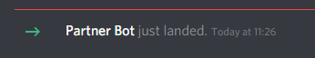

Partner Bot is now in your server and ready to partner away!

## Setting up your Partner Channel

Now that Partner Bot is in your server, it is time to setup your Partner Channel. This channel is the place where Partnership messages are sent in your server! We recommend a very basic setup for your Partner Channel to prevent any confusion during setup.

Click the plus (`+`) symbol under a category to create a new text channel, make sure Text Channel is selected, give it a cool name (we recommend `#partners`) and hit Create Channel!

Next up, hit the gear icon to the right of the channel name to open the channel settings. Click the permissions tab from the list on the left, and you will arrive at a page that looks like this:

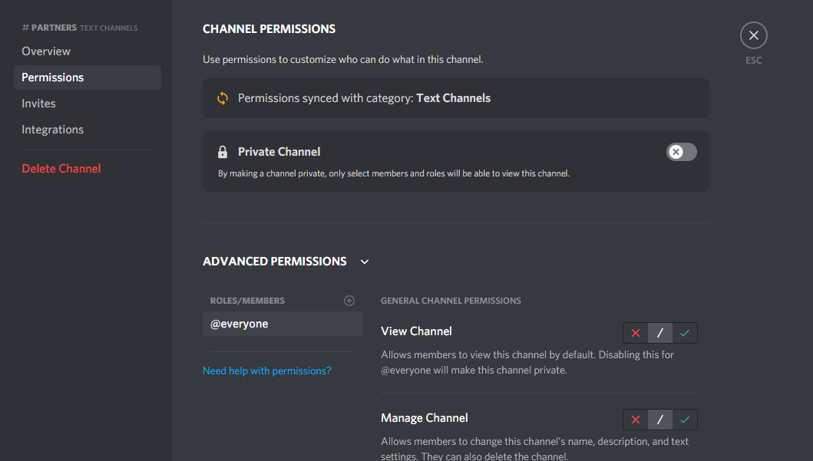

For the `@everyone` permission, change **View Channel** to the green check mark, **Send Messages** to the red cross, and **Read Message History** to the green check mark:

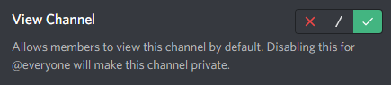
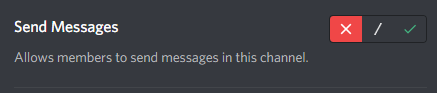
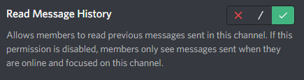

This lets everyone see the channel, but not send their own messages in it! Unfortunately, it also blocks Partner Bot from sending messages, so we need to add a new role to the permission list. Click on the plus (`+`) symbol next to `ROLES/MEMBERS` underneath the Advanced Permissions header. Select the Partner Bot role from the dropdown list. You now have a new set of permissions. Just like the `@everyone` permission, we are setting **View Channel** and **Read Message History** to the green check mark, but we will set **Send Messages** to the green check mark as well this time.

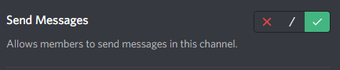

Now your partner channel is all configured and ready to go!

## Completing the Basic Setup

It's time to finally setup Partner Bot! Head on over to any channel Partner Bot can send messages in, and run the command `setup`. Be default the prefix will be `pb!`, so the full command looks like `pb!setup`, but if your prefix has changed then replace `pb!` with whatever the prefix on your server is!

Once `setup` has been run, you will see two menus. The first is your setup status menu:

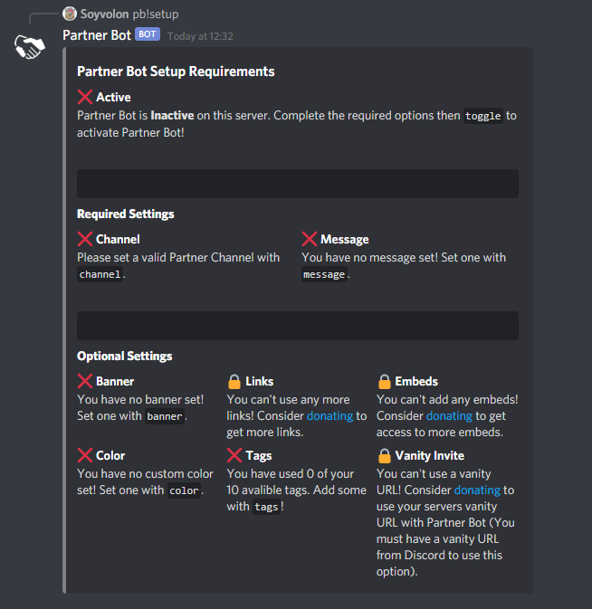

This menu is where you can see the status of your servers setup with Partner Bot. Items with green check marks are completed, items with red crosses have not be setup yet, and items with locks require you to be a donor of a higher tier to access.

The second menu you will be using is the main menu:

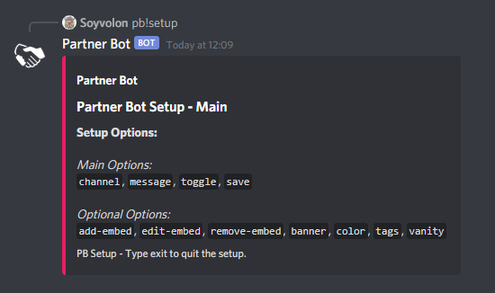

This menu contains all the options for setting up parts of Partner Bot. To access any option, just type exactly the words in the code block, ex: `message`, and only those words to select that option. The embed will then update with more instructions to guide you through setting up that option.

> You can type `exit` at any time to quit the setup menu.

**First step:** Setting your channel. Now that you have the Partner Setup running, you can type `channel` to start the channel setup process. Partner Bot will ask you for your channel, so go ahead and mention your channel in response (our mention is `#partners`).

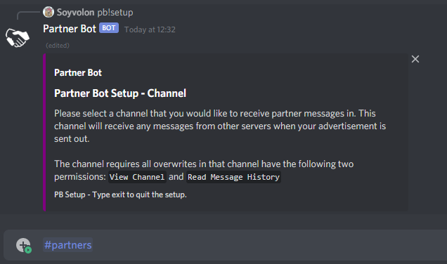

Once done, Partner Bot will save your channel if everything was configured properly. If not, Partner Bot will let you know what went wrong so you can fix it! There will be a green check mark by **Channel** on the status menu if it saved properly!

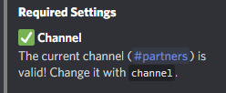

**Second step:** Setting your Partner Message. 

!> If you don't have a message already, we recommend you type `save` to save the setup progress you made and come back to the setup after you have a message created!

You can type `message` once you are back on the main page to head into the message setup menu. Once there, send your message in Discord so Partner Bot can pick it up and save it! You will get a display that shows what your message will look like, so make sure all your formatting is correct then type `save` to save your message.

> Discord links will always be removed from your message, and only donors can add other custom links - see [Donation Setup Options](#donation-setup-options) for more information

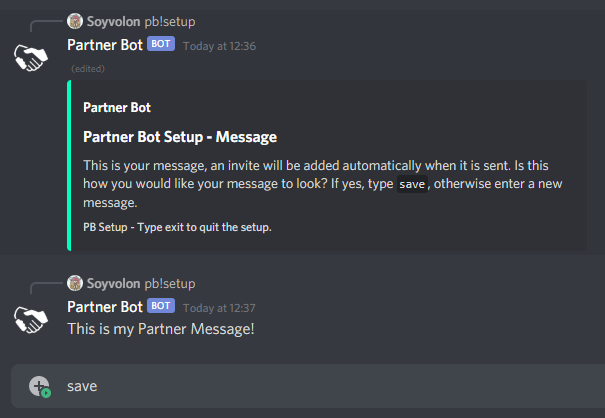

Once you are back on the main menu, and you have a green check mark for the **Channel** and **Partner Message** setup options, you can turn on Partner Bot! Type `toggle` to active Partner Bot on your server.

You should now have three green check marks, two for the **Channel** and **Partner Message** options, and one for the **Toggle** option:

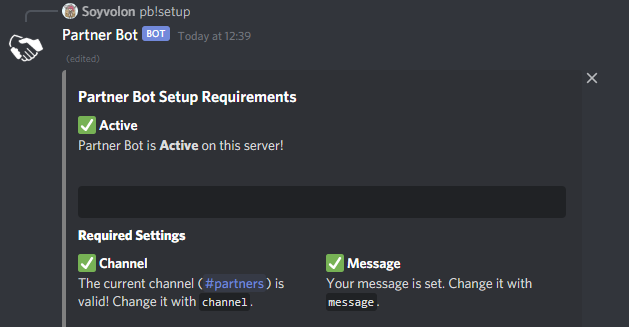

Once your setup menu is toggled on, you can save it by typing `save`! Once saved you will get a green embed telling you the Partner Setup is saved:

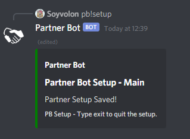

Partner Bot is completely automatic from here on out, so no need to do anything else but wait! For a non-donator, Partner Bot will send a Partner Message every hour, on the hour (`hh:00`).

## Advanced Setup Options

From custom embed coloring to adding your own banner to your **Partner Message**, these advanced options allow further customization of your message! Check them out on our [Optional Config](/optional-config) page!

## Donation Setup Options

For even further customization, including adding custom links, using your servers vanity invite, and adding custom embeds to your message, check out our [Donor Only Config](/donor-config) page!