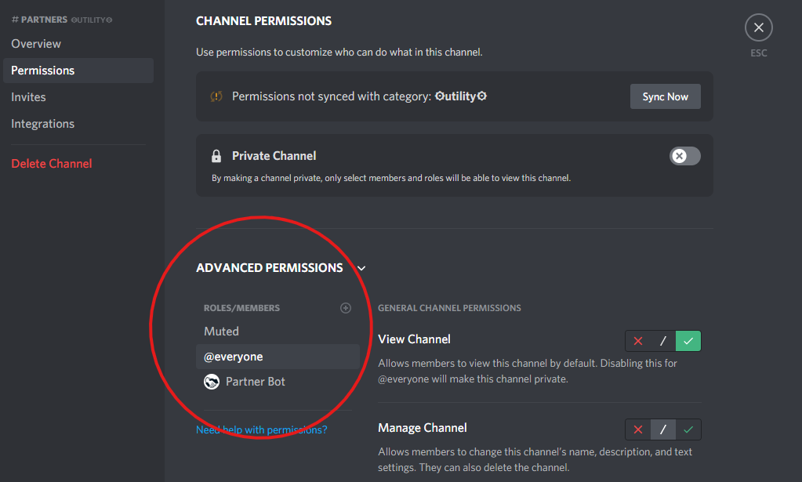

<!-- docs/required-config.md -->
# Required Setup Options

> For detailed information on setting the required setup options up, please check out our [quickstart guide](/quickstart)

## Partner Channel

The Partner Channel is the location in which you will receive partner advertisements in return for sending your advertisements out. The channel itself must be visible to all members of the server. To ensure this is the case, any role overwrites in the channel **must** have the `View Channel` and `Read Message History` permissions. 

An overwrite is a permission in the channel, by default, a new channel will only have the `@everyone` overwrite, or the overwrites inherited by the category. The area circled in red is where the overwrites are located:

Keep in mind you do not need to add every role on your server to this list, only the permissions that are there need to be edited.

## Partner Message

The Partner Message is another important part of setting up your server. This is the main thing that other people will see when your server gets advertised. All it is is a message, and works with standard discord formatting, so feel free to customize it within those bounds. Emojis also work, so don't be afraid to spice your message up with them!

Discord invite links are not allowed in your message, and one will be auto generated for you when you setup Partner Bot. Any other links are only available as [donor only config](/donor-config) options.